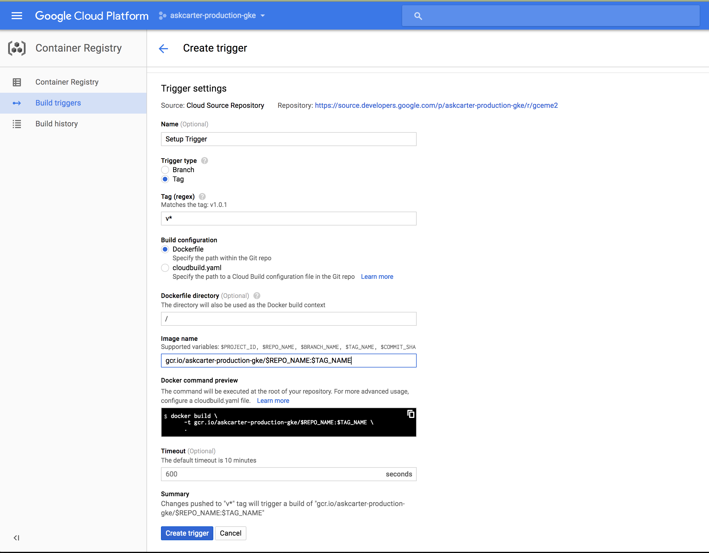

# Automating Pipleine

Until now, we've been manually triggering the pipeline when we want it to run. 
Now we'll use a build trigger to connect our Container Registry to Spinnaker, so that whenever we tag an image for release, we'll kick off a spinnaker deployment.

Note: Want to build on tag, not every check-in (to save disk space)

## Set up the Build Trigger



In the Google Cloud Console, set the build trigger to: 
 'Changes pushed to "v.*" tag will trigger a build of "gcr.io/askcarter-production-gke/$REPO_NAME:$TAG_NAME"'

## Tag an image, Trigger a build

Back on the command line, set up the cloud repository.

```shell
$ gcloud beta source repos create gceme
$ git config credential.helper gcloud.sh
$ git remote add google https://source.developers.google.com/p/REPLACE_WITH_YOUR_PROJECT_ID/r/gceme
$ git push --all google
```

Now, use git to tag a commit and trigger the build.

```shell
$ git tag -a v2.0.0 -m "my version 2.0.0"
$ git push google v2.0.0
```

Back in the Spinnaker UI, our build should've kicked off.
