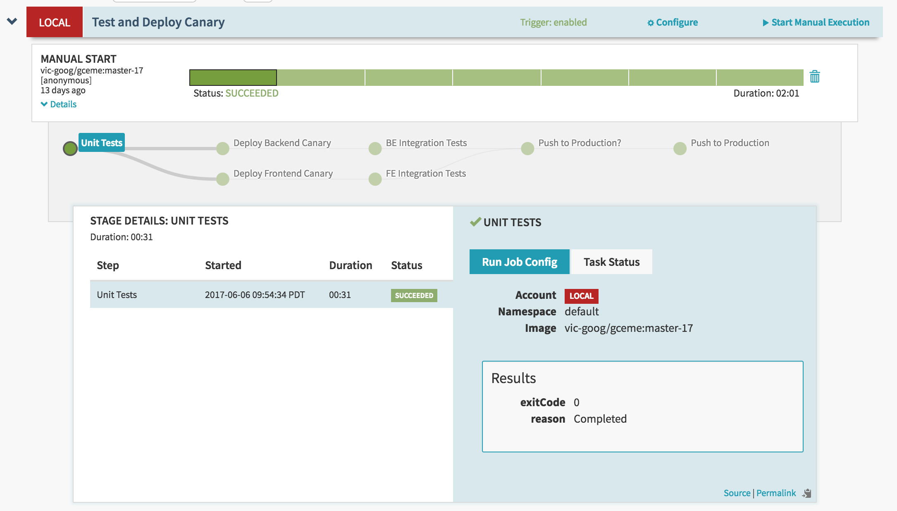
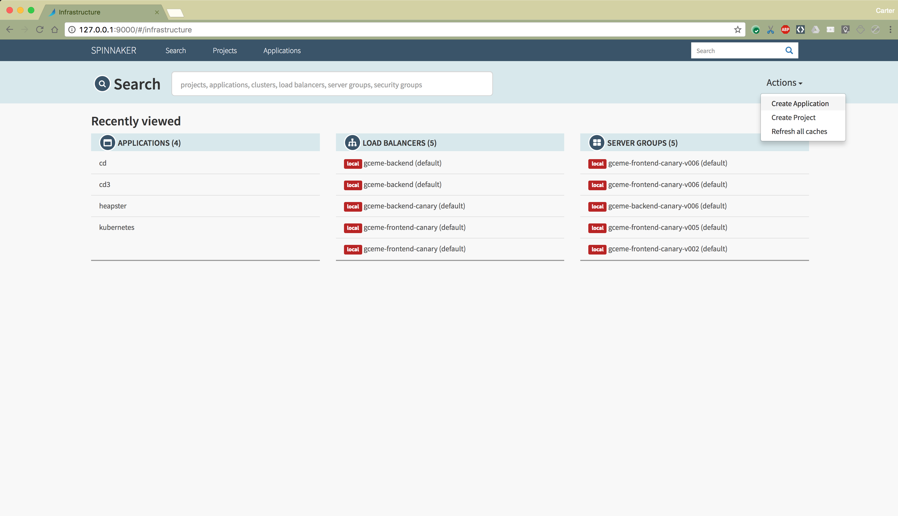
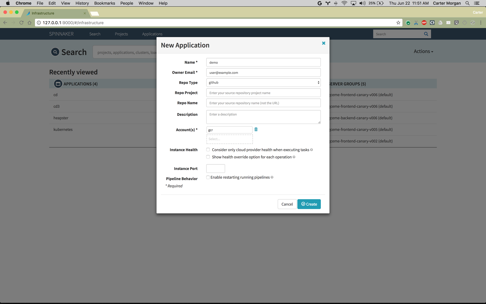
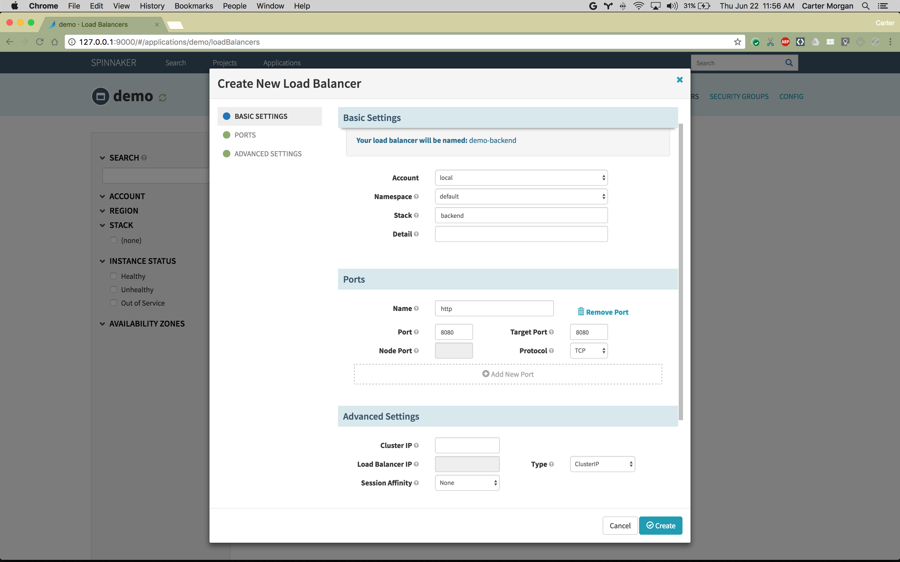
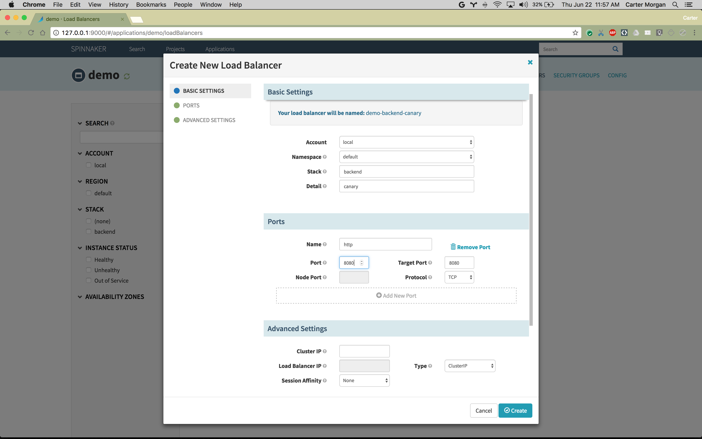
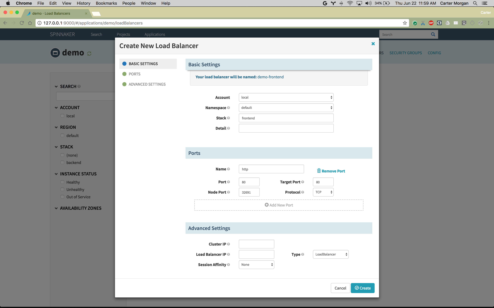

# Creating Your Pipeline

TODO:  Should look this nice (except going to upload yaml for pipelines.
https://www.spinnaker.io/guides/tutorials/codelabs/kubernetes-source-to-prod/

## Configuring Pipeline
All changes should be done from pipeline (as other configs will get overwritten when the pipeline pushes new versions from the old template).

Strategy=none is important for using deployments.  

## Create Application

Click, "Create Application" from the "Actions" menu, in the upper-right of the UI.

Fill in the mandatory fields.

For the Repo Type, select "github".

In the Account(s) field, select "gcr".

Note: If gcr doesn't appear in the Account(s) field, our account credentials may not be set up correctly.  
 

## Create Load Balancers

Now it's time to create LoadBalancers to route traffic to our application instances.

We'll create four (4), for production and canary versions of our front-end and back-end.

For each of the loadbalancers, following the following instructions.

Click the "Createz Load Balancer" button.

Copy the settings for the various load balancers from the images below.

For the backend production Load Balancer, fill in the following settings:

| Field | Value |
| --- | --- |
| Stack | backend |
| Name | http |
| Port | 8080 |
| Target Port | 8080 |

For the backend canary Load Balancer, fill in the following settings:

| Field | Value |
| --- | --- |
| Stack | frontend |
| Detail | canary |
| Name | http |
| Port | 8080 |
| Target Port | 8080 |
| NodePort | 32691 |

For the frontend production Load Balancer, fill in the follow settings:

| Field | Value |
| --- | --- |
| Stack | frontend |
| Name | http |
| Port | 80 |
| Target Port | 80 |
| NodePort | 32691 |
| Type | LoadBalancer |

For the frontend canary Load Balancer, fill in the following settings:

| Field | Value |
| --- | --- |
| Stack | frontend |
| Detail | canary |
| Name | http |
| Port | 80 |
| Target Port | 80 |
| NodePort | 30239 |
| Type | LoadBalancer | 

## Create Deploy Pipeline

Click "Create Pipeline or Strategy".

Name the new Pipeline "Deploy".

In the Pipeline Actions dropdown, click "Edit as Json".

Replace the JSON that displays with the contents on pipeline.json.

